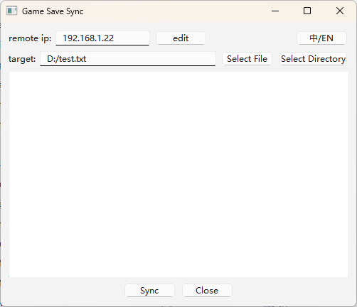

# Game Save Sync

[README](README.md) | [中文文档](README_zh_CN.md)

`game-save-sync` is a GUI tool for synchronizing files or directories.  
It was originally created to sync game saves between my PC and Steam Deck,  
as Steam cannot sync third-party game saves or may fail due to network issues.



## Quick Start
1. Ensure the tool is running on both sides.
2. Enter the Remote IP
3. Select a File or Directory
4. Press "Sync"

You can download the Windows version from the [release page](https://github.com/AlpsMonaco/game-save-sync/releases).  
For Linux/Mac OS, you'll need to install `python` or package it yourself.

## Features
- Requires the same file or directory names on both sides
- Cross-platform support
- Simple and easy to use
- English/Chinese

## Project Setup

**Ensure you have Python installed.**

### Initialize

#### Windows
```powershell
python -m venv venv
call venv\Scripts\activate
pip install -r requirements.txt
```

#### Linux/Mac OS
```bash
python -m venv venv
source venv/bin/activate
pip install -r requirements.txt
```

### Generate gRPC Code

#### Windows
```powershell
python -m grpc_tools.protoc -I=. --python_out=. --grpc_python_out=. rpc_service.proto  
```
Or simply run `generate.bat`.

#### Linux/Mac OS
```bash
python -m grpc_tools.protoc -I=. --python_out=. --grpc_python_out=. rpc_service.proto  
```
Or simply run `generate.sh`.

### Run the Application
#### Windows
```powershell
python mainwindow.py
```

#### Linux/Mac OS
```bash
python mainwindow.py
```

### Package to Binary
#### Windows
```powershell
pyinstaller game-save-sync.spec
```
Or simply run `pack.bat`.

#### Linux/Mac OS
```bash
pyinstaller game-save-sync.spec
```
Or simply run `pack.sh`.


### Non-GUI Environment
To run this tool in a non-GUI environment, such as on a Linux server with a public IP, simply use the following command:
```bash
python rpc_service.py [file or directory path]
```