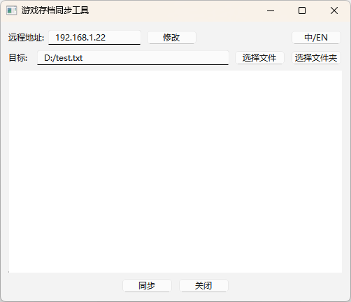

# 游戏存档同步工具

`game-save-sync` 是一个用于同步文件或目录的 GUI 工具。  
它最初设计用于在我的 PC 和 Steam Deck 之间同步游戏存档，  
因为 Steam 无法同步第三方游戏存档，或者由于网络问题导致同步失败。



## 快速开始
1. 输入远程 IP
2. 选择文件或目录
3. 点击“Sync”按钮

你可以从 [发布页面](#) 下载 Windows 版本。  
对于 Linux/Mac OS，你需要安装 `python` 或自行打包。

## 功能
- 两端的文件或目录名称必须相同
- 跨平台支持
- 简单易用

## 项目设置

**确保已安装 Python 解释器。**

### 初始化

#### Windows
```powershell
python -m venv venv
call venv\Scripts\activate
pip install -r requirements.txt
```

#### Linux/Mac OS
```bash
python -m venv venv
source venv/bin/activate
pip install -r requirements.txt
```

### 生成 gRPC 代码

#### Windows
```powershell
python -m grpc_tools.protoc -I=. --python_out=. --grpc_python_out=. rpc_service.proto  
```
或者直接运行 `generate.bat`.

#### Linux/Mac OS
```bash
python -m grpc_tools.protoc -I=. --python_out=. --grpc_python_out=. rpc_service.proto  
```
或者直接运行 `generate.sh`.

### 运行程序
#### Windows
```powershell
python mainwindow.py
```

#### Linux/Mac OS
```bash
python mainwindow.py
```

### 打包为可执行文件
#### Windows
```powershell
pyinstaller game-save-sync.spec
```
或者直接运行 pack.bat.

#### Linux/Mac OS
```bash
pyinstaller game-save-sync.spec
```
或者直接运行 pack.sh.